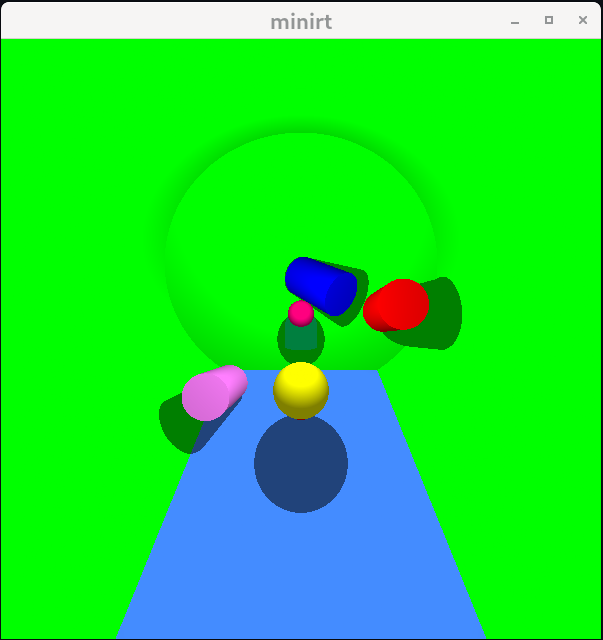

# C-RayTracer [miniRT]

A minimalist raytracer in C powered by MLX42. It parses `.rt` scene files and renders simple 3D scenes with ambient and diffuse lighting in real time.

---

## Description

This is a stripped-down raytracer implementing the mandatory part of the miniRT project from the 42 Network. It reads a scene description (`.rt`), builds basic geometric objects (plane, sphere, cylinder), and displays the result in an adjustable MLX42 window.

It was made with @jackwaddington and demonstrates low-level graphics, vector math, file parsing in C, and following the 42 Norm C coding standard.

## Features

* **Geometric Primitives:** Plane, Sphere, Cylinder
* **Lighting:** Ambient and diffuse lighting with single point light source
* **Transformations:** Translation for all objects; rotation for planes, cylinders, and camera
* **Parsing:** Robust `.rt` parser enforcing strict order and value ranges
* **Window Management:** Resizable MLX42 window; clean exit on ESC or window close
* **Memory Safety:** All allocations are freed on exit

## Prerequisites

* C compiler (gcc)
* GNU make
* Standard C libraries and math library

## Installation

```bash
# Clone miniRT and build
git clone https://github.com/BrunoPosa/C-RayTracer miniRT
cd miniRT
make
```

## Usage

```bash
./miniRT scenes/2_just_shadows.rt
```

* **ESC**: Exit program
* **Window close**: Clean exit
* **Resize window**: Image scales to fit

## Scene File Format

Each line defines one element, in any order. Elements with single identifiers (`A`, `C`, `L`) appear once only.

* **Ambience:** `A <ratio> <R,G,B>`
* **Camera:** `C <pos> <orient> <FOV>`
* **Light:**  `L <pos> <brightness> <R,G,B>`
* **Sphere:** `sp <center> <diameter> <R,G,B>`
* **Plane:**  `pl <point> <normal>   <R,G,B>`
* **Cylinder:** `cy <center> <axis> <diameter> <height> <R,G,B>`

*Example:* `scenes/8.rt`

```text
A 0.3 255,255,255
C 0,0,50 0,0,-1 60
L 0,0,20 1.0 255,255,255
sp 0,0,0 10 255,0,0
sp 20,0,0 10 0,255,0
cy 0,0,-10 0,1,0 10 20 0,0,255
cy -20,0,-10 0,1,0 10 20 255,255,0
pl 0,0,-30 0,1,0 0,0,255
```


## Example scene 3_inside_objects.rt



## Next Steps

* Add reflections, shadows, and specular highlights
* Implement bonus objects: square, triangle, cube
* Optimize with bounding volumes and multithreading

